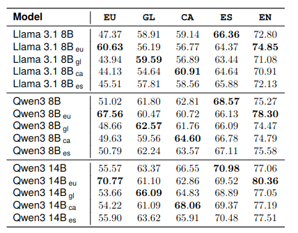
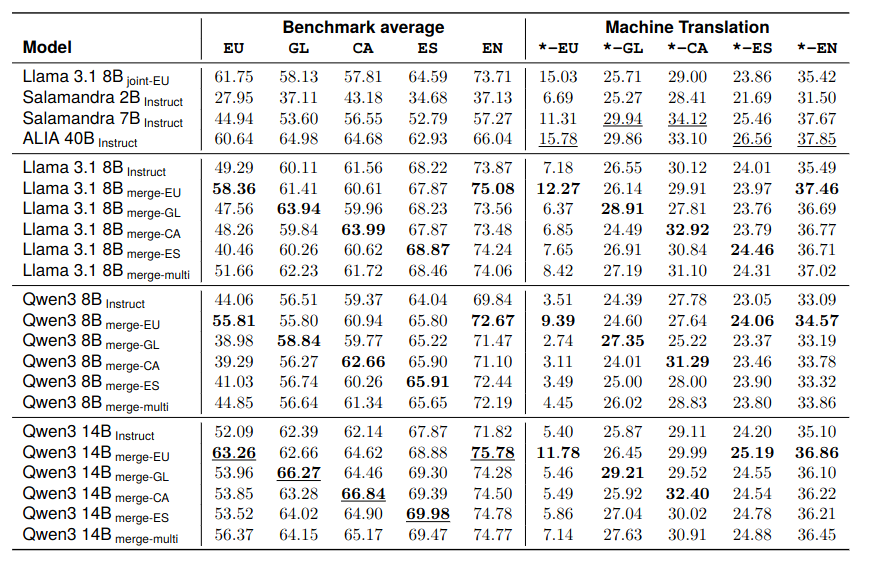
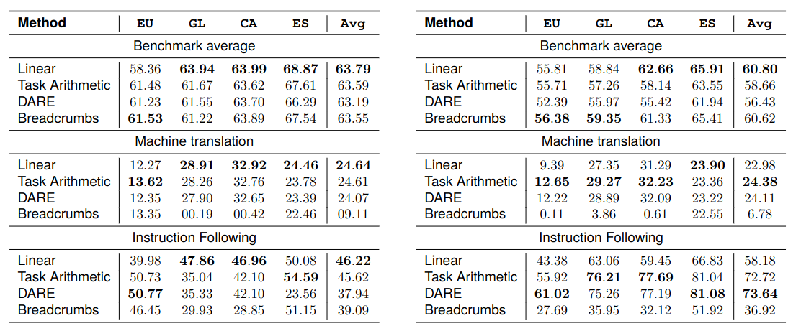
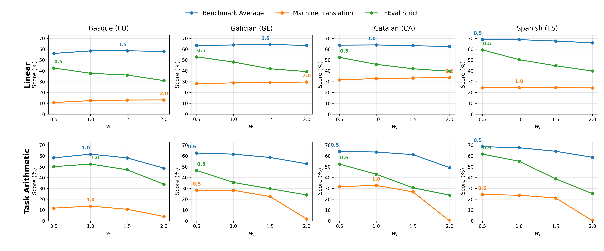
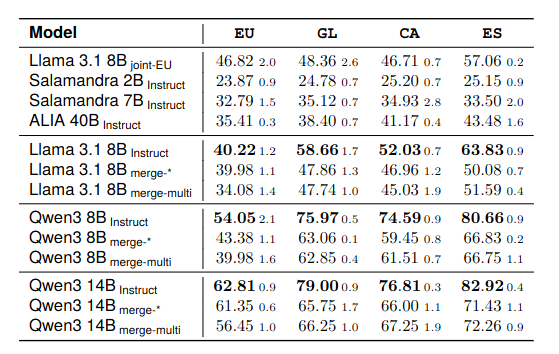

<div align="center">

# Merge and Conquer

### Instructing multilingual models by adding target-language weights

[](https://lrec.elra.info/lrec2026-main-800)
[](https://doi.org/10.63317/4k6cgmb8djof)
[](https://arxiv.org/abs/2603.28263)
[](https://huggingface.co/collections/HiTZ/merge-and-conquer)
[](#repository-structure)

This repository contains the model merging and evaluation scripts used in the LREC 2026 paper  
**[Merge and Conquer: Instructing Multilingual Models by Adding Target Language Weights](https://lrec.elra.info/lrec2026-main-800)**.

</div>

---

## Overview

Large language models are still strongly centered on high-resource languages, while many low-resource languages lack the instruction data and computational resources required to repeatedly train strong instructed models. This project explores **model merging** as a lightweight alternative: combining the instruction-following capabilities of an instructed model with the target-language knowledge of language-adapted base models.

The paper studies whether language-specific knowledge can be transferred into instruction-tuned LLMs by merging model weights, avoiding repeated instruction tuning whenever stronger instructed variants become available. The experiments cover **Basque (EU), Galician (GL), Catalan (CA), Spanish (ES), and English (EN)** across Llama 3.1 and Qwen3 model families.

This repository is intended as a compact research artifact for the paper. It is not a general-purpose framework: it mainly contains the scripts used to run the model merging and evaluation experiments.

---

## Links

| Resource | Description |
|---|---|
| [LREC 2026 proceedings paper](https://lrec.elra.info/lrec2026-main-800) | Official proceedings page for the paper. |
| [arXiv preprint](https://arxiv.org/abs/2603.28263) | Preprint version of the paper. |
| [Hugging Face collection](https://huggingface.co/collections/HiTZ/merge-and-conquer) | Released resources associated with the paper, including language-adapted base models and IFEval variants. |
| [Repository scripts](#repository-structure) | Evaluation and model-merging scripts used in the experiments. |

---

## Repository structure

```text
.
├── evaluation/
│   └── scripts/          # Scripts used to evaluate original and merged models
├── merges/
│   └── scripts/          # Scripts used to create the model merges
├── assets/               # Figures and result tables shown in this README
└── README.md
```

The repository deliberately excludes large or intermediate experiment outputs such as SLURM logs, JSON result files, and merged model checkpoints.

---

## Hugging Face collection

The associated Hugging Face collection contains the public resources released with the paper:

- language-adapted base models used in the merge experiments;
- resources for Llama 3.1 and Qwen3 model families;
- the IFEval variants for **Basque** and **Galician** used in the instruction-following evaluation.

<div align="center">

[Open the collection on Hugging Face](https://huggingface.co/collections/HiTZ/merge-and-conquer)

</div>

---

## Results at a glance

The following tables and figures summarize the main results reported in the paper. Bold values indicate the best result within the same model backbone or comparison group.

### Base models after language adaptation

Language-adapted base models improve the target language before instruction merging, especially in settings where the original model has more headroom.

<p align="center">
  
</p>

### Main results

The main experiments compare instructed baselines, language-specific merges, and multilingual merges across benchmark accuracy and machine translation.

<p align="center">
  
</p>

### Merge method comparison

We compare several merging methods, including **Linear**, **Task Arithmetic**, **DARE**, and **Breadcrumbs**. Overall, Linear and Task Arithmetic are the strongest merging strategies in our experiments, but the results also show that merging behavior is highly dependent on the language, model family, and evaluation axis. In practice, merging is not a one-step recipe: it requires testing different models, methods, proportions, and evaluation settings.

<p align="center">
  
</p>

### Merge proportion ablation

After comparing merging methods, we analyze the effect of the merge proportion \(w_i\) for **Linear** and **Task Arithmetic**, the two strongest overall strategies from the method comparison. Increasing \(w_i\) gives more influence to the language-adapted base model, which generally improves target-language transfer but can hurt instruction-following ability.

The trade-off is smoother for Linear: benchmark and machine translation performance remain relatively stable as \(w_i\) increases. Task Arithmetic can achieve strong results at lower proportions, but it becomes much less stable and may collapse when \(w_i\) is too high, especially around \(w_i \geq 1.5\). Across languages, values in the range \(w_i \in [0.5, 1.0)\) usually provide robust performance.

<p align="center">
  
</p>

### Instruction following

IFEval is used to evaluate instruction-following ability after merging. The results show that adding target-language knowledge can improve multilingual performance, although instruction-following can degrade depending on the merge configuration and model family.

<p align="center">
  
</p>

---

## Main takeaway

This work shows that model merging is a feasible alternative to continual pre-training and repeated instruction tuning for extending instructed LLMs to low-resource and under-represented languages. The merged models can transfer target-language proficiency from specialized base models into instructed variants, improving benchmark and machine translation performance while preserving instruction following in many settings.

At the same time, the experiments show that merging is sensitive to the selected model family, target language, method, and merge proportion. Linear and Task Arithmetic perform best overall in our setting, but careful validation is necessary: there is no universally optimal merge configuration.

Overall, the results suggest that model merging can help bridge the gap between efficiency and multilingual coverage, providing a practical path for adapting LLMs to languages with fewer available resources.

---

## Running the scripts

The scripts were written for an HPC/SLURM environment and may contain cluster-specific paths, partitions, environments, and model locations. Before running them in a different environment, check and adapt:

- SLURM account and partition names;
- local model paths;
- output directories;
- Python or Conda environment names;
- Hugging Face cache paths;
- GPU requirements and tensor parallelism settings.

For private or gated Hugging Face models, do not hardcode tokens in the scripts. Use an environment variable instead:

```bash
export HF_TOKEN="your_token_here"
```

Then run the relevant SLURM script, for example:

```bash
sbatch evaluation/scripts/path/to/script.sh
```

or:

```bash
sbatch merges/scripts/path/to/script.sh
```

---

## Citation

If you use this repository, the associated models, or the IFEval variants, please cite the paper:

```bibtex
@inproceedings{valero-etal-2026-merge,
  title     = {Merge and Conquer: Instructing Multilingual Models by Adding Target Language Weights},
  author    = {Valero, Eneko and Ribalta i Albado, Maria and Sainz, Oscar and Perez, Naiara and Rigau, German},
  booktitle = {Proceedings of the Fifteenth Language Resources and Evaluation Conference (LREC 2026)},
  year      = {2026},
  pages     = {10192--10207},
  publisher = {European Language Resources Association (ELRA)},
  address   = {Palma, Mallorca, Spain},
  doi       = {10.63317/4k6cgmb8djof},
  url       = {https://lrec.elra.info/lrec2026-main-800}
}
```

---

## Acknowledgements

This work was accepted at **LREC 2026** and was developed as part of an exploration of efficient multilingual adaptation for low-resource and Iberian languages.

---

## Contact

For questions about the repository or the released resources, please open an issue in this repository.
